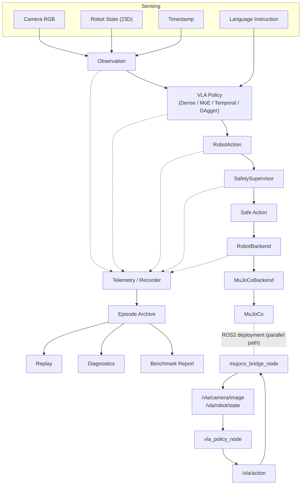

[English](README.md) | [中文](README.zh-CN.md)

# Vision-Language-Action Robot Control: Closed-Loop Learning, Mixture-of-Experts, Temporal Modeling, Corrective Imitation, and ROS2 Deployment

**Project status: v1.0 — VLA Robot Learning, Closed-Loop Evaluation, and Deployment Research Platform.**

> This project investigates the gap between offline Vision-Language-Action imitation accuracy and reliable closed-loop robotic control through controlled experiments on dense Transformers, sparse Mixture-of-Experts routing, temporal history, and corrective on-policy imitation learning, then extends the learned policy into a modular robotics runtime with backend abstraction, ROS2 integration, safety supervision, telemetry, replay, and reproducible system-level evaluation.

---

## 1. Project Overview

A vision-language-action (VLA) policy is trained by behavior cloning to pick up a red cube in MuJoCo simulation, conditioned on a camera image, 23D proprioceptive state, and a natural-language instruction. Ten milestones build this from a bare simulation environment to a fully-tested, deployment-oriented robotics research platform: a scripted expert generates demonstrations; a dense multimodal Transformer learns from them; the policy is evaluated in closed loop (not just offline); a sparse Mixture-of-Experts variant, a temporal-history variant, and a DAgger-corrected variant are each compared against the same frozen baselines; the policy is then decoupled from the simulator via a backend abstraction, deployed through a ROS2 node graph, and wrapped in a production-style runtime with safety supervision, structured telemetry, and replay.

This is a **research and systems platform**, not a production robot product. It runs entirely in simulation; no physical robot has been used or is claimed.

---

## 2. Research Motivation

Offline imitation-learning metrics (test-set action error) are cheap to compute and easy to optimize, but a robot policy is judged by whether it completes the task when it acts on its own (possibly imperfect) outputs in a closed loop. These two evaluations can diverge sharply: a policy with near-perfect one-step action prediction can still fail the task most of the time, because small per-step errors compound as the policy visits states its own earlier actions produced — states the supervised training distribution never covered. This project treats that divergence as the central object of study, rather than as noise to average away, and asks which interventions (more model capacity, temporal context, corrective on-policy data, better deployment infrastructure) actually close it.

---

## 3. Research Questions

**Primary research question:**

> Why can a Vision-Language-Action policy achieve excellent offline imitation accuracy yet remain unreliable under closed-loop robotic control, and how do model capacity, temporal context, corrective on-policy data, and deployment/runtime structure affect this gap?

### Research Hypotheses

```text
H1: High offline imitation accuracy is insufficient to predict closed-loop reliability.
H2: Sparse MoE capacity/specialization may improve multimodal VLA control.
H3: Temporal history may reduce control inconsistency caused by memoryless policies.
H4: On-policy corrective data may mitigate exposure bias.
H5: Deployable learned robot policies require runtime structure beyond the neural policy itself.
```

### Hypothesis Outcomes

```text
H1: Strongly supported. Every model variant showed excellent offline metrics
    (joint MAE 0.0025-0.0047 rad, gripper accuracy 99.9-100%) alongside closed-loop
    success rates from 0% to 24% -- offline error ranked models almost the
    OPPOSITE of how closed-loop success ranked them (Temporal+DAgger had the
    best-improved offline corrective metric and the worst closed-loop success
    among the temporal-family models).

H2: Not supported by task-success results. Sparse MoE learned clean,
    interpretable modality-associated routing (see Section 13), but closed-loop
    success (0%/2%/4%) was the worst of all four systems, and batch-1 latency
    was ~1.7x Dense's on Apple MPS.

H3: Partially supported. Temporal history reduced gripper-open/close
    oscillation by ~10x (mean switches 25.1 -> 2.4), a real and large effect on
    action consistency, but closed-loop success (22%/16%/14%) was statistically
    indistinguishable from Dense's (24%/18%/12%) at n=50 per condition.

H4: Not supported by the current implementation. The DAgger round measurably
    improved the offline metric it directly targeted (corrective-state joint MAE
    0.0563 -> 0.0213, a 62% reduction) but closed-loop success fell from 22% to
    4%. The experiment is confounded by a specific, identified teacher-labeling
    flaw (Section 15) rather than showing corrective learning is unhelpful in
    general.

H5: Supported as an engineering requirement. Reaching a testable ROS2
    deployment and a production-style runtime required a backend abstraction,
    explicit QoS/synchronization/staleness handling, a watchdog, a safety
    supervisor, structured telemetry, and replay -- none of which the neural
    policy itself provides.
```

No formal statistical significance testing (e.g. binomial confidence intervals or a paired test across seeds) was performed; "statistically indistinguishable" above is a qualitative read of n=50-episode success-rate gaps that are small relative to expected sampling noise at that n, not a claim backed by a computed p-value.

---

## 4. Contributions

These are **project contributions** (engineering and controlled-experiment contributions), not claims of novel science:

```text
1. End-to-end language-conditioned robot learning pipeline (simulation -> expert ->
   dataset -> behavior cloning -> closed-loop evaluation)
2. A controlled Dense-vs-Sparse-MoE comparison holding data/training/evaluation fixed
3. Quantitative analysis of the offline-to-closed-loop mismatch across four model variants
4. A temporal-history experiment isolating action-consistency (gripper oscillation)
   as a specific, fixable failure mode, separate from overall task success
5. A corrective on-policy (DAgger) data pipeline with an identified, documented failure mode
6. A simulator-agnostic RobotBackend architecture (MuJoCoBackend / FakeRobotBackend /
   a documented future-hardware extension point)
7. A ROS2 deployment architecture (custom messages, two nodes, QoS design, launch file)
   with real rclpy integration tests
8. A safety/telemetry/replay production runtime layered on top of the learned policy
9. A reproducible benchmark and a shared, unified failure taxonomy across all four models
```

---

## 5. System Architecture



```text
                  Language Instruction
                          |
                          v

Camera RGB ---------+
                     |
Robot State ---------+------> Observation
                     |
Timestamp -----------+
                          |
                          v
                ┌───────────────────┐
                │    VLA Policy     │
                │ Dense / MoE /     │
                │ Temporal / DAgger │
                └─────────┬─────────┘
                          |
                     RobotAction
                          |
                          v
                ┌───────────────────┐
                │ Safety Supervisor │
                └─────────┬─────────┘
                          |
                     Safe Action
                          |
                          v
                ┌───────────────────┐
                │   RobotBackend    │
                └─────────┬─────────┘
                          |
                     MuJoCoBackend
                          |
                          v
                       MuJoCo
```

ROS2 deployment (`ros2_ws/`) is a transport/runtime integration layer built around these same abstractions -- see Section 16.

---

## 6. End-to-End Data/Control Flow

### 6.1 Direct runtime path (`runtime/run_episode.py`)

```text
runner
  |
  v
RobotBackend.get_observation()
  |
  v
Observation
  |
  v
policy.predict(observation, instruction)
  |
  v
RobotAction
  |
  v
SafetySupervisor.process(...)
  |
  v
RobotBackend.execute_action(...)
  |
  v
MuJoCoBackend
  |
  v
SimulationEnvironment.step(...)
  |
  v
MuJoCo
```

### 6.2 ROS2 deployment path

```text
MuJoCo
  |
  v
mujoco_bridge_node
  |
  v
/vla/camera/image
/vla/robot/state
  |
  v
vla_policy_node
  |
  v
Observation reconstruction
  |
  v
policy.predict(...)
  |
  v
/vla/action
  |
  v
bridge / validator
  |
  v
MuJoCo
```

`mujoco_bridge_node` is the ONLY ROS2-layer component that knows MuJoCo exists; `vla_policy_node` never imports it (statically verified by `tests/test_ros2_node_files.py`). Both paths call the SAME `policy.predict(observation, instruction)` contract and the SAME `RobotBackend`/validation primitives underneath -- the ROS2 layer changes transport, not semantics (verified directly for the direct-vs-`RobotBackend` case by `tests/test_backend_closed_loop_equivalence.py`).

### 6.3 Ownership / Responsibility

| Component | Responsibility | Knows MuJoCo? | Knows ROS2? | Knows ML model? |
|---|---|---:|---:|---:|
| Policy (`models/*_policy.py`) | inference | No | No | Yes |
| RobotBackend (`robot_backend/base.py`) | robot interface | No | No | No |
| MuJoCoBackend | simulator adapter | Yes | No | No |
| SafetySupervisor (`safety/supervisor.py`) | runtime action safety | No | No | No |
| ROS2 Policy Node (`vla_policy_node`) | transport wrapper around policy | No | Yes | Yes |
| ROS2 Bridge Node (`mujoco_bridge_node`) | simulator <-> ROS2 transport | Yes | Yes | No |
| Recorder (`telemetry/recorder.py`) | telemetry/archive | No | No | No |
| Replay (`tools/replay_episode.py`) | reads recorded telemetry only | No | No | No (never loads a policy) |

---

## 7. Observation and Action Contracts

**`Observation`** (`observations/observation.py`):

```text
rgb:       (H, W, 3) uint8 camera image
state:     23D proprioceptive vector (RobotState.as_vector())
timestamp: float
```

**`RobotState` = 23D** (`observations/robot_state.py`), composition:

```text
7  joint positions           (radians)
7  joint velocities          (radians/s)
3  end-effector position     (meters, xyz)
4  end-effector quaternion   (w, x, y, z)
2  finger positions          (meters)
```

Intentionally excluded: cube ground-truth position, any expert/controller internal phase, Jacobians, success-detector internals, or any safety-supervisor state. The policy never receives these -- see Section 20.5.

**`RobotAction`** (`control/action.py`):

```text
joint_targets:   (7,) float64, radians -- desired arm joint positions
gripper_target:  float in [0, 1] -- 0 = fully closed, 1 = fully open
```

Denormalization (network output -> physical units) happens inside each policy's `predict()` (e.g. `models/policy.py`, `models/temporal_policy.py`) via a train-split-only-fit `ActionNormalizer`; normalization of the state input happens the same way via `StateNormalizer`. Both normalizers are persisted in every checkpoint and loaded alongside the model weights -- inference never recomputes them.

Plus, outside the `Observation`/`RobotAction` dataclasses: an `instruction: str` argument to `policy.predict()`.

---

## 8. Simulation Environment

MuJoCo (`simulation/environment.py`, `simulation/scene.xml`): a 7-DoF Franka Emika Panda arm with a parallel gripper, a fixed overhead/angled camera (640x480), and one red cube on a table. `SimulationEnvironment` is the only module in the repository allowed to reference MuJoCo types (`MjModel`/`MjData`/renderer/joint IDs) directly; every other module receives simulator-agnostic `Observation`/`RobotAction`/`RobotState` objects. Physics stepping: `control_substeps = 10` `mj_step` calls per `env.step(action)`; this cadence is a single authoritative constant and is never silently altered by any higher layer (ROS2 or otherwise) -- see Section 16.

---

## 9. Expert Demonstration Pipeline

`control/scripted_controller.py::ScriptedController` is a deterministic, privileged (ground-truth cube position + Jacobian) 6D pose-controlled state machine: `HOME -> ABOVE_CUBE -> DESCEND -> CLOSE_GRIPPER -> LIFT -> DONE`, using damped least-squares pose IK (`control/kinematics.py`) to hold a fixed top-down grasp orientation through descent/grasp/lift. This expert is used only to *generate* training data and, in Step 8, to *label* corrective states offline -- it is never on the learned policy's execution path.

---

## 10. Dataset

```text
100 episodes, 21,443 total timestep samples
80 / 10 / 10 episode-level split (never per-timestep -- adjacent frames are
    near-duplicates, so a per-frame split would leak into validation)
cube XY randomization: +/-3cm (uniform)
4 instruction variants: "Pick up the red cube.", "Grasp the red cube.",
    "Lift the red cube.", "Pick up the red block."
```

Generated entirely by the scripted expert (`dataset/generate_dataset.py`); only episodes that pass the physical success detector (`control.success.sustained_lift_success` -- a real, sustained cube-height gain, never `controller.done`) are kept.

**Dataset limitations** (see also Section 27): single object, fixed camera, fixed lighting, fixed initial robot pose, successful expert trajectories only (no deliberately-induced-failure demonstrations in the base dataset).

---

## 11. Dense VLA (Step 4)

```text
RGB    -> ResNet18 (frozen, ImageNet-pretrained) -> 512D
Language -> DistilBERT (frozen)                  -> 768D
23D state -> MLP                                 -> 256D

Projection -> [VISION, LANGUAGE, STATE, ACTION_QUERY]   (4 tokens)

4-layer, 8-head dense Transformer encoder (hidden=256, ffn=1024)
    -> ACTION_QUERY output representation

Action head -> 7 joint targets (normalized) + 1 gripper logit
```

Loss: `MSE(joint targets) + BCEWithLogits(gripper)`. Trained AdamW, lr=1e-4, 30 epochs, seed=42.

**Offline** (held-out test split, 2,159 samples): joint MAE **0.0029 rad**, gripper accuracy **99.95%**.

---

## 12. Closed-Loop Evaluation (Step 5)

`evaluation/closed_loop.py::run_closed_loop_episode` drives the policy in a real MuJoCo rollout: `policy.predict(observation, instruction)` only (never cube position/Jacobian/controller stage -- enforced by `tests/test_no_privileged_vla_inputs.py`), task success measured by the SAME physical `sustained_lift_success` detector the expert dataset used (never a model "done" signal, since the model doesn't have one). Protocol used for every model in this project: 50 episodes per condition, cube XY offset drawn from a seeded RNG (seed 42 for the official benchmark), `max_steps=350`, no action smoothing unless explicitly noted.

**Dense closed-loop**: **24% / 18% / 12%** success at +/-3cm / +/-4cm / +/-5cm.

Failure breakdown at +/-3cm: `failed_to_lift 21, pushed_cube_away 13, grasped_but_dropped 3, timeout 1`.

**Interpretation**: excellent offline behavior-cloning accuracy did not imply reliable closed-loop control -- the central finding this entire project is organized around (Section 21).

---

## 13. Sparse MoE VLA (Step 6)

```text
4 experts, top-1 routing, MoE FFN replacing the dense FFN in Transformer
layers 1 and 3 (0-indexed); dense self-attention retained in every layer;
Switch-Transformer-style load-balancing auxiliary loss; UNWEIGHTED top-1
output (not scaled by router probability) -- a deliberate choice so the
Dense-initialized MoE reproduces Dense's output almost exactly at init
(verified: max joint output difference ~2.4e-7).
```

**Offline**: joint MAE **0.0026 rad**, gripper accuracy **100%**.

**Closed-loop**: **0% / 2% / 4%** -- the worst of all four systems.

**Routing specialization** (Layer 1, evaluation-only diagnostic, never fed back into the model):

```text
LANGUAGE     -> Expert 3  (~100% of tokens)
VISION       -> Expert 1  (~96%)
STATE        -> Expert 2  (~89%)
ACTION_QUERY -> Expert 0  (~85%)
```

**Latency** (batch-1, Apple MPS): Dense **~6.25ms**, MoE **~10.41ms** -- MoE's Python-level conditional-dispatch loop over experts was slower on this device despite fewer active FLOPs per token, since MPS was not the target hardware sparse MoE kernels are usually optimized for.

**Interpretation**: sparse MoE learned real, clean, modality-associated routing -- a genuine emergent specialization -- but neither that specialization nor the added capacity improved closed-loop control, and it introduced runtime overhead on this hardware. **We do not claim the specialization caused the closed-loop failure**; both are true simultaneously without an established causal link between them.

---

## 14. Temporal Dense VLA (Step 7)

```text
history_length = 4

For each of 4 window positions (t-3, t-2, t-1, t):
  RGB -> VisionEncoder (shared, frozen) --\
  State -> StateEncoder (shared)           +--> sum --> +temporal position embedding --> token
  PrevAction -> ActionHistoryEncoder (new) -/
  (position t's PrevAction slot is always a NO_ACTION sentinel -- see below)

[token_t-3, token_t-2, token_t-1, token_t, LANGUAGE, ACTION_QUERY]
    -> Dense Transformer (identical size to Dense/MoE's backbone, NO MoE)
    -> ACTION_QUERY output -> Action head -> 8D action
```

The `NO_ACTION` sentinel (`models/temporal_history.py`) is `zeros(7)` (normalized joints) + `gripper=0.5` ("unknown"), used for BOTH left-padding at episode start AND the current/last window slot (using the real action there would be target leakage into the model's own input -- exhaustively tested, including deliberately-huge-offset synthetic episodes to make any cross-episode leakage numerically obvious).

**Critical train/inference distinction**: during training, the previous-action window is the EXPERT's recorded actions (teacher forcing); at inference, `TemporalDenseVLAPolicy` builds it from the POLICY'S OWN previously issued actions. This is a real, acknowledged, tested source of train/inference distribution shift, not hidden.

**Offline**: joint MAE **0.0025 rad**, gripper accuracy **100%**.

**Closed-loop**: **22% / 16% / 14%** -- close to Dense's, not a large jump.

**Gripper switches (mean, +/-3cm, 50 episodes)** -- the central Step 7 measurement:

```text
Dense:     25.1   (median 23.5)
MoE:       37.9   (median 39.0, worse than Dense)
Temporal:   2.4   (median  1.0, ~10x fewer than Dense)
```

**Interpretation**: short-term temporal context dramatically reduced gripper-timing oscillation, a real and mechanistically explainable fix (the model can now tell "I already started closing" from "I haven't decided yet"). It did NOT proportionally convert that consistency gain into a large closed-loop success improvement -- an important result precisely because it separates two distinct failure axes (action *consistency* vs. overall trajectory *robustness*) that a single success-rate number conflates.

---

## 15. DAgger / Corrective On-Policy Data (Step 8)

```text
Student (Temporal) executes; Teacher (a NEW, stateless corrective expert)
only LABELS the same state offline -- the teacher's action is never
executed during collection (verified: tests/test_dagger_expert_not_executed.py).
```

**Round 1**: 50 episodes, +/-3cm, seed 123 (distinct from the seed-42 evaluation benchmark), sample every 3 ticks + any gripper-decision-disagreement tick, joint-L2-disagreement threshold 0.15 rad.

```text
Candidate timesteps: 15,278
Retained corrective samples: 7,963 (52.1%)
Mean joint-L2 disagreement (model vs. corrective expert): 0.110 rad
Gripper disagreement rate: 15.2% of ticks
```

Fine-tuned (not retrained) from the Temporal checkpoint, 15 epochs, AdamW lr=5e-5, 50/50 expert/corrective batch mixing.

**Targeted offline metric improved as intended**: corrective-state joint MAE **0.0563 -> 0.0213** (-62%), gripper accuracy on those held-out corrective states **45.7% -> 74.2%**.

**Closed-loop degraded**:

```text
                  ID +/-3cm   OOD +/-4cm   OOD +/-5cm
Dense                 24%          18%          12%
MoE                    0%           2%           4%
Temporal               22%          16%          14%
Temporal + DAgger       4%           2%           2%
```

**Root cause, diagnosed by trajectory tracing** (not merely inferred): the corrective expert's `LIFT`-phase trigger fires from gripper-closed + Cartesian position alone, with no verification that the cube was actually secured. Because 36.6% of the retained corrective data carries this label -- generated overwhelmingly from Temporal's own failed collection-time rollouts (78% of 50 episodes) -- the fine-tuned model learned to confidently commit to a lift/retract motion immediately after closing the gripper, regardless of whether anything was grasped. Failure-taxonomy shift is consistent with exactly this: `pushed_cube_away` fell (15 -> 5, i.e. the model got MORE cautious/precise on approach) while `failed_to_lift` rose sharply (22 -> 40) and mean cube-lift-delta collapsed 3x (0.019m -> 0.007m).

**Correct conclusion (do not overstate the negative result)**:

> This DAgger implementation exposed the sensitivity of on-policy corrective learning to teacher-label quality. It does not show that DAgger-style correction is fundamentally unhelpful for this problem -- see Section 28 (Future Work) for the identified, un-implemented fix (a grasp-verification gate on the corrective expert's LIFT trigger).

---

## 16. ROS2 Deployment Architecture (Step 9)

### 16.1 `RobotBackend` abstraction

```python
class RobotBackend(ABC):
    def get_observation(self) -> Observation: ...
    def execute_action(self, action: RobotAction) -> None: ...
    def reset(self) -> None: ...
    def close(self) -> None: ...
```

`MuJoCoBackend` wraps the unmodified `SimulationEnvironment` (no physics duplicated). `FakeRobotBackend` is a MuJoCo-free test double proving the policy loop has no MuJoCo dependency. `FutureHardwareBackend` is a documented, intentionally-unimplemented extension point (raises `NotImplementedError` on construction) -- proof the real-hardware contract needs no ABC changes, not a claim hardware support exists. `robot_backend/backend_closed_loop.py::run_closed_loop_episode_via_backend` is verified **byte-identical** to the original direct path for the same seed/checkpoint.

### 16.2 ROS2 package

```text
ros2_ws/src/
├── vla_robot_control_msgs/   (ament_cmake -- message/service generation)
│   ├── msg/VLARobotAction.msg   stamp, joint_targets[7], gripper_target
│   └── srv/ResetEpisode.srv     --- success (bool), message (string)
└── vla_robot_control/         (ament_python)
    ├── mujoco_bridge_node.py    the ONLY ROS2 node importing MuJoCoBackend
    ├── vla_policy_node.py       never imports MuJoCo
    ├── launch/mujoco_vla.launch.py
    └── config/default_params.yaml
```

Topics: `/vla/camera/image` (`sensor_msgs/Image`), `/vla/robot/state` (`sensor_msgs/JointState`), `/vla/action` (`VLARobotAction`), `/task_instruction` (`std_msgs/String`). Service: `/reset_episode`.

**QoS** (explicit, never left at implicit defaults): camera/state `BEST_EFFORT`, depth 1 (a dropped frame must not block the newest one); action commands `RELIABLE`, depth 5 (a dropped command is worse than a dropped frame, and the watchdog bounds staleness); instruction `RELIABLE` + `TRANSIENT_LOCAL`, depth 1 (a (re)started node should still see the last instruction).

**rclpy-free logic layer** (`ros_integration/`, fully unit-tested WITHOUT ROS2 installed): `serialization.py` (Observation/RobotAction <-> ROS-message-shaped field dicts), `command_validator.py`, `watchdog.py`, `sync.py` (`LatestMessageSynchronizer` + `StalenessChecker`), `instruction_cache.py`, `episode_manager.py` (backend -> policy -> metrics reset ordering), `policy_node_core.py` / `bridge_node_core.py` (the entire control-loop logic of each ROS2 node, as plain Python classes the thin `rclpy.Node` subclasses wrap).

### 16.3 Environment and test status

```text
Implementation machine:  macOS (Darwin), Apple Silicon, Python 3.14 (.venv) --
                          no ROS2 distribution installed here.
Verification machine:    Ubuntu 24.04, ROS2 Jazzy, Python 3.12, CUDA available.
```

```text
pytest, macOS (no ROS2):        351 passed, 1 skipped
pytest, Ubuntu 24.04/ROS2 Jazzy: 354 passed, 0 skipped
```

The 354/0 result includes 3 real `rclpy` integration tests (`pytest -m ros2`): both node files import cleanly with no MuJoCo-isolation violations, and a multi-step ROS2 smoke rollout (bridge publishes -> policy node synchronizes/predicts/publishes -> bridge validates/executes) runs end-to-end for real, not simulated.

**Direct vs. `RobotBackend`-mediated latency** (5 episodes, seed 42, macOS/MPS) -- NOT a ROS2 transport-latency measurement:

```text
                     Direct              Via RobotBackend
Inference (ms)   mean 12.92  p50 12.53  p95 14.42     mean 12.73  p50 12.46  p95 15.12
Execute   (ms)   mean  0.13  p50  0.11  p95  0.26     mean  0.14  p50  0.12  p95  0.25
```

`RobotBackend` introduced no measurable practical overhead in this benchmark.

### 16.4 ROS2 Limitation (stated plainly, not in fine print)

> The ROS2 packages, messages, services, QoS design, rclpy integration, and multi-step message flow are validated on Ubuntu 24.04 / ROS2 Jazzy. A fully stable live MuJoCo <-> ROS2 <-> VLA launch rollout remains partially unresolved due to observation synchronization/staleness behavior; therefore **no ROS2 closed-loop task-success benchmark is reported**.

Bugs found and fixed while pursuing that live verification (documented for engineering-process transparency, not because they are unresolved): a `pytest`/`colcon`-generated entry-point-script Python-interpreter mismatch (fixed by invoking `python3 -m pytest` and rebuilding with the correct interpreter active), `device:=cuda` requested on a VM without real GPU passthrough (fixed: use `device:=cpu`), and a genuine code bug where both ROS2 nodes computed "now" via `time.monotonic()` (an arbitrary, boot-relative clock) while message header stamps used `self.get_clock().now()` (epoch-based) -- fixed by reading the ROS clock consistently everywhere. After that fix, `mujoco_bridge_node` and `vla_policy_node` both start, load the checkpoint, and connect over correctly-matched topics/QoS, but the policy node was still observed reporting "observation stale or not yet synchronized" during live debugging: transport-level diagnostics (`ros2 topic hz`, `ros2 topic echo`, `ros2 topic info -v`) all showed healthy message flow, so the remaining issue is most likely in the synchronization/staleness *logic* itself rather than the transport -- **not yet root-caused** at the time of writing.

---

## 17. Production Runtime / Safety (Step 10)

**Disclaimer, stated explicitly**: this is runtime safety supervision for simulation and research deployment. It is **NOT** functional safety certification, SIL-rated safety, ISO 10218 industrial-robot certification, hardware emergency-stop certification, or real-robot collision certification.

`safety/supervisor.py::SafetySupervisor` sits between `policy.predict()` and `RobotBackend.execute_action()`. It **composes** (does not duplicate) Step 9's `CommandValidator` (shape/finite/gripper-range/max-joint-delta checks); joint bounds are read from the backend (`MuJoCoBackend.get_joint_range()` -> `SimulationEnvironment.get_joint_range()`, a single authoritative source, never a second hardcoded copy).

**Decisions**: `ACCEPT`, `CLAMP`, `HOLD`, `REJECT`, `STOP_EPISODE`. **Reason codes**: `NONFINITE_ACTION`, `INVALID_SHAPE`, `INVALID_GRIPPER`, `MAX_JOINT_DELTA`, `JOINT_LIMIT`, `STALE_OBSERVATION`, `COMMAND_TIMEOUT`, `BACKEND_NOT_READY`, `REPEATED_INTERVENTION`. Every intervention is recorded as a `SafetyEvent` (small, JSON-serializable -- joint targets and a gripper float, never a raw RGB frame) referencing the step it occurred at.

**Observed in real recorded rollouts**: 6 demo episodes (Temporal policy, `+/-3cm`, seeds 0-5), 1,667 total control ticks, **0 safety interventions** -- consistent with a well-trained policy that reliably produces well-formed actions; the supervisor's intervention logic is exercised and verified separately by 14 dedicated unit tests covering every decision/reason path (`tests/test_safety_supervisor.py`).

---

## 18. Telemetry and Replay (Step 10)

```text
outputs/episodes/episode_<YYYYMMDD_HHMMSS>/
├── metadata.json      policy/checkpoint/instruction/seed/backend/device/outcome/git commit
├── telemetry.jsonl    one independently-parseable JSON object per control tick
├── metrics.json       episode-level aggregates (latency percentiles, gripper switches,
│                      safety intervention/stale/watchdog counts, success, cube lift)
├── frames/000000.png  optional per-tick frames (--record)
└── video.mp4          optional, built from frames/ via imageio if available
```

Each telemetry line: episode/step id, wall-clock + simulation timestamps, instruction, policy type, observation timestamp, prediction start/end, inference latency, original AND executed `RobotAction`, gripper command, safety decision + reason, backend execution latency, and cube-height-delta (a privileged, evaluation-only diagnostic -- never fed back into the policy; see Section 20.5).

**Replay** (`python -m tools.replay_episode outputs/episodes/<episode>`) answers *"what actually happened during that recorded rollout?"*, never *"what would the current model predict now?"* -- it reads only `telemetry.jsonl`/`metadata.json`/`metrics.json` and **never imports or calls a policy class** (statically verified: `tests/test_replay_episode.py::test_replay_never_imports_a_policy_class`).

---

## 19. Quantitative Results

Every number below is pulled programmatically from stored evaluation outputs by `evaluation/final_benchmark.py` (`outputs/evaluation/final/policy_comparison.csv`) -- not hand-copied.

| Policy | Offline joint MAE | Gripper acc. | ID +/-3cm | OOD +/-4cm | OOD +/-5cm | Mean gripper switches | Batch-1 latency |
|---|---:|---:|---:|---:|---:|---:|---:|
| Dense | 0.0029 rad | 99.95% | 24% | 18% | 12% | 25.1 | ~6.25 ms |
| Sparse MoE | 0.0026 rad | 100% | 0% | 2% | 4% | 37.9 | ~10.41 ms |
| Temporal | 0.0025 rad | 100% | 22% | 16% | 14% | 2.4 | ~6.34 ms |
| Temporal + DAgger | 0.0047 rad | 99.86% | 4% | 2% | 2% | 3.0 | ~6.20 ms |

Parameter counts: Dense 81,198,408 total / 3,659,016 trainable; MoE 84,353,872 / 6,814,480; Temporal and Temporal+DAgger (identical architecture) 81,299,656 / 3,760,264.

---

## 20. Failure Analysis

`evaluation/metrics.py::classify_failure` provides ONE unified, heuristic failure taxonomy applied identically to all four models: `failed_to_lift`, `pushed_cube_away`, `grasped_but_dropped`, `gripper_never_closed`, `reached_but_misaligned`, `never_reached_cube`, `timeout_uncategorized`. Historical failures are never retroactively reclassified without new evidence.

**`failed_to_lift`** (the dominant category for Dense, Temporal, and especially Temporal+DAgger): the arm reaches the cube and closes the gripper, but no sustained height gain is ever recorded. For Dense/Temporal this reads as generic approach/grasp imprecision compounding over a 350-tick rollout; for Temporal+DAgger, direct trajectory tracing (Section 15) showed a MORE specific mechanism -- the policy learned to abandon grasp attempts confidently rather than to recover from them.

**`pushed_cube_away`** (dominant for MoE): the gripper makes contact with the cube off-center or at an angle that shoves it sideways rather than enclosing it -- consistent with MoE's much higher gripper-switch count (37.9): indecisive open/close timing near the cube increases the chance of a glancing, cube-displacing contact instead of a clean grasp attempt.

**`grasped_but_dropped`**: the gripper closes and the cube visibly lifts partially, then falls -- a real grasp that failed to hold, most common for MoE (9/50) and least common for Temporal (2/50), consistent with Temporal's much steadier gripper commands giving the grasp more time to stabilize before any lift attempt.

**Gripper oscillation** as a distinct axis from task success (Section 14): fixed almost entirely by temporal context, without a proportional task-success gain -- direct evidence that "the gripper flip-flops" and "the arm doesn't reach/align/grasp correctly" are two separate failure mechanisms that a single aggregate success number conflates.

**Recovery failure / teacher-label error**: the DAgger-specific failure mode (Section 15) -- not a new PHYSICAL failure category, but a new *behavioral* one: the policy actively gives up on a marginal grasp rather than continuing to attempt it, learned from a teacher label that itself never verified grasp success before committing to LIFT.

### 20.1 The Offline-to-Closed-Loop Gap

The supervised training/test distribution consists of STATES THE EXPERT VISITED. A trained policy's closed-loop trajectory instead visits states ITS OWN actions produced. When those two distributions coincide closely (as they do near the start of a rollout, close to the training distribution), offline accuracy is a reasonable local proxy. As small per-step action errors compound, the policy's own state trajectory drifts away from anything the expert (or, in DAgger's case, the flawed corrective teacher) actually demonstrated recovering from -- producing states with no reliable label in the training data, where the "reasonable-looking" learned behavior can be arbitrarily wrong. This project treats that mechanism as strongly evidenced by the observed offline/closed-loop divergence across all four models (Section 19), not as a formally proven causal chain -- no controlled intervention isolating exactly this mechanism (e.g. deliberately perturbing the policy mid-rollout and measuring recovery) was run.

---

## 21. Research Findings

**Finding 1.** Offline VLA accuracy is a poor proxy for closed-loop reliability -- observed identically across all four model variants (Section 19).

**Finding 2.** Sparse MoE can learn modality-associated expert specialization (Section 13) without producing better task performance.

**Finding 3.** Temporal history can fix a specific behavioral pathology -- gripper oscillation -- without solving overall trajectory robustness (Section 14).

**Finding 4.** Corrective on-policy learning is only as good as the teacher labels used to supervise recovery (Section 15).

**Finding 5.** Robot-learning evaluation must include trajectory-level failure analysis, not just supervised test loss -- every major finding in this project came from closed-loop rollout analysis, none from the offline test metric alone.

**Finding 6.** Deploying a learned robot policy requires synchronization, runtime validation, watchdogs, backend abstraction, telemetry, and replay in addition to the neural model (Sections 16-18).

---

## 22. Classical CPS vs. Learned VLA

> For a fixed, structured, single-object manipulation task with privileged state and known geometry, the scripted controller (`ScriptedController`, Section 9) is more reliable and simpler than the learned VLA policy. It uses exact cube position and a closed-form 6D pose IK solve, and (per Section 9/10 of the project history) reliably completes the task.

The purpose of this benchmark is therefore **not** to argue that learned VLA control is superior to classical control on this narrow, fully-observed, geometrically-known task -- it plainly is not, for this task, under this comparison. The purpose is to use a task simple enough to make the comparison controlled and legible, in order to study the reliability and deployment challenges that arise specifically when control is learned from vision, proprioception, and language rather than manually programmed from privileged state -- challenges (offline/closed-loop mismatch, exposure bias, teacher-label sensitivity, deployment/runtime structure) that persist and matter more, not less, as tasks scale beyond what classical control can specify by hand.

---

## 23. Reproducibility

```text
[x] environment dependencies       -- requirements.txt / Section 24
[x] dataset generation command     -- python -m dataset.generate_dataset --episodes 100 --seed 42
[x] train commands                 -- training/train.py, train_moe.py, train_temporal.py, train_dagger.py
[x] checkpoint locations            -- outputs/training/{dense,moe,temporal_dense,temporal_dagger}_vla_run_001/
[x] evaluation commands             -- training/evaluate*.py, simulation/evaluate_*_closed_loop.py
[x] random seeds                    -- seed=42 (training/official closed-loop benchmark), seed=123 (DAgger collection)
[x] final result JSON               -- outputs/evaluation/final/{research_summary,runtime_summary,safety_summary}.json,
                                        policy_comparison.csv
[x] ROS2 test command                -- pytest -m ros2 (Section 16.3)
[x] demo command                     -- python -m demo.run (Section 24)
```

All seeds, checkpoints, `control_substeps=10`, `max_steps=350` (closed-loop) / `400` (data generation), cube randomization (`+/-3cm` ID, `+/-4cm`/`+/-5cm` OOD), and the fixed instruction set are stated per-table above and in each subsystem's own module docstring.

---

## 24. Demo

```bash
# Direct MuJoCo demo (recorded, produces frames/ + video.mp4 + full telemetry archive)
python -m demo.run \
    --backend mujoco --policy temporal \
    --checkpoint outputs/training/temporal_dense_vla_run_001/best.pt \
    --instruction "Pick up the red cube." \
    --seed 2 --record

# Replay a recorded episode (reads telemetry only, never re-invokes the policy)
python -m tools.replay_episode outputs/episodes/<episode_dir>

# Final benchmark aggregation (reads stored evaluation outputs only)
python -m evaluation.final_benchmark

# ROS2 build + tests (needs a real ROS2 install -- see Section 16.3)
cd ros2_ws && colcon build --symlink-install && source install/setup.bash
pytest -m ros2
```

A representative **successful** rollout was recorded at seed=2 (134 steps) and seed=3 (133 steps) out of 6 demo episodes run at seeds 0-5 (2/6 succeeded); this is a real, verified rollout, **not** a claim about typical success probability -- the measured aggregate closed-loop success rate for Temporal is 22% at this same randomization (Section 19, n=50).

---

## 25. Testing

```bash
python3 -m pytest                    # everything; the ros2-marked file self-skips cleanly if rclpy is absent
python3 -m pytest -m "not ros2"      # explicit pure-Python suite (no ROS2 needed)
python3 -m pytest -m ros2             # ROS2 integration suite only -- needs a real ROS2 install
```

```text
macOS (no ROS2 installed):        confirmed passing, Step 1-10 combined
Ubuntu 24.04 / ROS2 Jazzy / CUDA: 354 passed, 0 skipped (Step 1-9 snapshot; includes 3 real rclpy tests)
```

A skipped test is never counted as passed anywhere in this project's reporting.

---

## 26. Project Structure

```text
observations/    Observation, RobotState (simulator-agnostic contracts)
control/         RobotAction, ScriptedController, kinematics, success detector
simulation/      SimulationEnvironment (the only MuJoCo-aware module) + demo/eval scripts
dataset/         demonstration generation, recording, episode loading, torch Datasets
models/          DenseVLA / MoEVLA / TemporalDenseVLA + their *Policy inference adapters
training/        train/evaluate scripts, losses, normalization, checkpointing
evaluation/      closed-loop runner, metrics/failure taxonomy, compare.py, final_benchmark.py
dagger/          corrective expert, disagreement, collector, aggregation (Step 8)
robot_backend/   RobotBackend ABC, MuJoCoBackend, FakeRobotBackend, FutureHardwareBackend (Step 9)
ros_integration/ rclpy-free ROS2 logic: serialization/validation/watchdog/sync/node-core (Step 9)
ros2_ws/         the ROS2 workspace: vla_robot_control_msgs + vla_robot_control packages (Step 9)
safety/          SafetySupervisor (Step 10)
telemetry/       EpisodeTelemetryRecorder (Step 10)
runtime/         run_episode.py, the production runtime loop (Step 10)
tools/           replay_episode.py (Step 10)
demo/            run.py, the showcase entry point (Step 10)
tests/           272 -> 351 -> 354(+3 ROS2) test files across all ten steps
```

---

## 27. Limitations

```text
single manipulation task (pick up one cube)
single object, single fixed camera viewpoint, fixed lighting
single robot embodiment (Franka Panda, simulated)
single primary simulator (MuJoCo) -- no cross-simulator validation
no real robot hardware, no sim-to-real validation attempted or claimed
no large-scale multi-task dataset (100 episodes, one task)
no foundation-scale VLA (ResNet18 + DistilBERT, not a large pretrained VLM)
limited seed/statistical analysis (single-seed training runs; n=50-episode
    closed-loop benchmarks with no formal significance testing across seeds)
ROS2 live launch (Section 16.4) partially unresolved -- no ROS2 closed-loop
    success benchmark
no safety certification of any kind (Section 17)
```

---

## 28. Future Work

**Learning**: a corrected DAgger teacher (grasp-verification gate on the LIFT trigger, capping how many consecutive same-phase corrective samples one failed episode can contribute) and a Round 2 evaluation gated on that fix; action chunking (deliberately deferred through Steps 7-8 to isolate temporal history and corrective data as independent variables, and now additionally motivated by the DAgger failure mode -- a chunked policy committing to several steps at once would make a bad LIFT-style commitment even harder to recover from until the corrective-expert fix lands); multi-task data; a larger VLA backbone; vision robustness (camera/lighting variation).

**Systems**: root-causing and fixing the live ROS2 synchronization/staleness issue (Section 16.4); a real hardware `RobotBackend` implementation; hardware-in-the-loop testing; real-time inference optimization.

**Generalization**: multiple objects, multiple manipulation skills, different cameras, different robot embodiments.

**Embodied AI**: mobile manipulation, locomotion, a hybrid high-level-VLA + low-level-learned-controller architecture.

None of the above is implemented in v1.0. Real-robot integration, a second manipulation task, a larger foundation model, or any embodied-AI extension is explicitly **out of scope** for this version and would begin as a new version, branch, or separate project.

---

## 29. Research / Resume Summary

This project studies the reliability gap between offline multimodal imitation learning and closed-loop robot control. Rather than treating task success as the only outcome, it isolates multiple hypotheses involving model capacity (Sparse MoE), temporal context (observation/action history), corrective supervision (DAgger), and deployment/runtime structure (RobotBackend abstraction, ROS2 integration, safety supervision, telemetry, replay). The results show that offline accuracy, expert specialization, and targeted corrective-state fitting can each improve local metrics without necessarily improving closed-loop task success -- and that closing that gap, or even deploying the resulting policy at all, requires systems engineering the model itself does not provide.

For a systems/robotics-software audience: this project also demonstrates a from-scratch simulator-agnostic backend abstraction, a real ROS2 node graph with explicit QoS/synchronization/watchdog design and passing `rclpy` integration tests, and a production-style runtime (safety supervisor, structured JSONL telemetry, replay, reproducible benchmark aggregation) built around a research model -- not a toy demo, and not claimed as more than that.

---

## 30. Citation / Project Status

```text
Project Status: v1.0 Complete
```

Real-robot deployment, a second manipulation task, and any embodied-AI extension are **future work** and are **not** required for, or claimed as part of, v1.0 completion.

```bibtex
@misc{vla_moe_robot_control_2026,
  title  = {Vision-Language-Action Robot Control: Closed-Loop Learning, Mixture-of-Experts,
            Temporal Modeling, Corrective Imitation, and ROS2 Deployment},
  author = {uudam},
  year   = {2026},
  note   = {v1.0 research platform. See README.md / README.zh-CN.md.},
  url    = {https://github.com/uudam42/vla-moe-robot-control}
}
```
