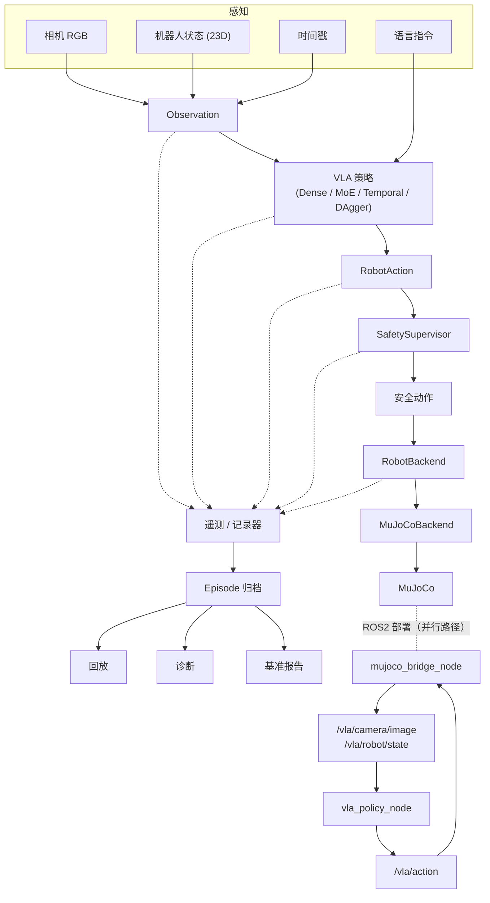

[English](README.md) | [中文](README.zh-CN.md)

# 视觉-语言-动作机器人控制：闭环学习、混合专家、时序建模、纠错模仿学习与 ROS2 部署

**项目状态：v1.0 —— VLA 机器人学习、闭环评估与部署研究平台。**

> 本项目研究视觉-语言-动作（VLA）模型在离线模仿学习精度与机器人闭环控制可靠性之间的差距，通过 Dense Transformer、稀疏 Mixture-of-Experts、时序历史以及在线纠错模仿学习进行受控实验，并进一步将 learned policy 扩展为包含机器人后端抽象、ROS2 集成、安全监督、运行遥测、回放以及可复现实验评估的模块化机器人运行系统。

---

## 1. 项目概览

本项目在 MuJoCo 仿真环境中，通过行为克隆（behavior cloning）训练一个视觉-语言-动作（VLA）策略去抓取一个红色方块，输入为相机图像、23 维本体感知状态和自然语言指令。项目分十个里程碑，从一个空白的仿真环境逐步构建出一个经过充分测试、面向部署的机器人学习研究平台：脚本专家生成示范数据；Dense 多模态 Transformer 从中学习；策略在闭环（而不仅是离线）条件下被评估；随后分别构建稀疏 Mixture-of-Experts 版本、时序历史版本、DAgger 纠错版本，并与同一组冻结基线进行对比；最后将策略与仿真器解耦（后端抽象），通过 ROS2 节点图部署，并封装进一个具备安全监督、结构化遥测与回放能力的生产级运行时。

这是一个**研究与系统平台**，不是可交付的生产机器人产品。全部实验在仿真中完成；未使用、也未声称使用过任何真实机器人。

---

## 2. 研究动机

离线模仿学习指标（测试集动作误差）计算成本低、优化目标明确，但机器人策略的真正评判标准是：当它在闭环中根据自己（可能不完美）的输出行动时，任务能否完成。这两种评估方式可能出现严重分歧：一个单步动作预测误差极小的策略，在闭环任务中却可能大部分时间失败——因为微小的单步误差会不断累积，策略会不断进入自己早期（略有偏差的）动作所导致的状态，而这些状态从未出现在监督训练分布中。本项目把这种分歧当作核心研究对象，而不是需要被平均掉的噪声，并追问：哪些干预手段（更大的模型容量、时序上下文、在线纠错数据、更好的部署基础设施）真正能够缩小这个差距。

---

## 3. 研究问题

**核心研究问题：**

> 为什么一个 VLA 模型可以在离线模仿学习中取得极低预测误差，却在机器人闭环控制中依然表现不稳定？模型容量、时序信息、在线纠错数据以及部署运行时架构分别会如何影响这一差距？

### 研究假设

```text
H1：高离线模仿精度不足以预测闭环可靠性。
H2：稀疏 MoE 的容量/专家特化可能提升多模态 VLA 的控制表现。
H3：时序历史可能减少无记忆策略导致的控制不一致性。
H4：在线纠错数据（on-policy）可能缓解暴露偏差（exposure bias）。
H5：可部署的 learned 机器人策略需要神经网络策略本身之外的运行时结构。
```

### 假设结论

```text
H1：强有力地被支持。每一个模型变体都展现出优异的离线指标
    （joint MAE 0.0025-0.0047 rad，gripper 准确率 99.9-100%），但闭环成功率
    却从 0% 到 24% 不等 —— 离线误差对模型的排序几乎与闭环成功率的排序相反
    （Temporal+DAgger 在时序系列模型中拥有改进最多的离线纠错指标，
    却是闭环成功率最差的）。

H2：任务成功率结果不支持这一假设。稀疏 MoE 学到了清晰、可解释的
    模态关联路由（见第 13 节），但闭环成功率（0%/2%/4%）是四个系统中最差的，
    在 Apple MPS 上 batch-1 延迟也约为 Dense 的 1.7 倍。

H3：部分支持。时序历史将夹爪开合震荡减少了约 10 倍
    （平均切换次数 25.1 -> 2.4），这是动作一致性上一个真实且显著的效果，
    但闭环成功率（22%/16%/14%）在 n=50 每条件的样本量下，
    与 Dense（24%/18%/12%）在统计上难以区分。

H4：当前实现不支持这一假设。这一轮 DAgger 在其直接优化的离线指标上
    确实取得了可测量的改进（纠错状态 joint MAE 0.0563 -> 0.0213，降低 62%），
    但闭环成功率从 22% 降到了 4%。该实验被一个已明确定位的
    教师标注缺陷（见第 15 节）所混淆，而不能说明在线纠错学习本身无效。

H5：作为工程需求被支持。要达到一个可测试的 ROS2 部署和生产级运行时，
    需要后端抽象、明确的 QoS/同步/过期处理、watchdog、安全监督器、
    结构化遥测和回放——这些都不是神经网络策略本身能提供的。
```

本项目未进行正式的统计显著性检验（例如跨种子的二项置信区间或配对检验）；上文中的"统计上难以区分"是对 n=50 episode 成功率差距的定性判断（该差距相对该样本量下预期的抽样噪声而言较小），而非基于计算出的 p 值的结论。

---

## 4. 项目贡献

以下是**项目工程/受控实验贡献**，而非"新颖科学发现"层面的声明：

```text
1. 端到端语言条件机器人学习流水线（仿真 -> 专家 -> 数据集 -> 行为克隆 -> 闭环评估）
2. 在固定数据/训练/评估条件下的受控 Dense-vs-Sparse-MoE 对比实验
3. 对四种模型变体的离线-闭环差距的定量分析
4. 一个把"动作一致性（夹爪震荡）"作为独立、可修复失败模式
   （区别于整体任务成功率）单独隔离出来的时序历史实验
5. 一条带有明确、已记录失败模式的在线纠错（DAgger）数据流水线
6. 一个仿真器无关的 RobotBackend 架构（MuJoCoBackend / FakeRobotBackend /
   一个已文档化的未来硬件扩展点）
7. 一个 ROS2 部署架构（自定义消息、两个节点、QoS 设计、launch 文件），
   带有真实的 rclpy 集成测试
8. 一个叠加在 learned policy 之上的安全/遥测/回放生产运行时
9. 一个可复现的基准测试，以及横跨全部四个模型统一的共享失败分类体系
```

---

## 5. 系统架构



```text
                     语言指令
                          |
                          v

相机 RGB ------------+
                     |
机器人状态 -----------+------> Observation
                     |
时间戳 --------------+
                          |
                          v
                ┌───────────────────┐
                │     VLA 策略      │
                │ Dense / MoE /     │
                │ Temporal / DAgger │
                └─────────┬─────────┘
                          |
                     RobotAction
                          |
                          v
                ┌───────────────────┐
                │  安全监督器        │
                └─────────┬─────────┘
                          |
                       安全动作
                          |
                          v
                ┌───────────────────┐
                │   RobotBackend    │
                └─────────┬─────────┘
                          |
                     MuJoCoBackend
                          |
                          v
                       MuJoCo
```

ROS2 部署（`ros2_ws/`）是围绕这些相同抽象构建的一层传输/运行时集成层——见第 16 节。

---

## 6. 端到端数据/控制流

### 6.1 直连运行时路径（`runtime/run_episode.py`）

```text
runner
  |
  v
RobotBackend.get_observation()
  |
  v
Observation
  |
  v
policy.predict(observation, instruction)
  |
  v
RobotAction
  |
  v
SafetySupervisor.process(...)
  |
  v
RobotBackend.execute_action(...)
  |
  v
MuJoCoBackend
  |
  v
SimulationEnvironment.step(...)
  |
  v
MuJoCo
```

### 6.2 ROS2 部署路径

```text
MuJoCo
  |
  v
mujoco_bridge_node
  |
  v
/vla/camera/image
/vla/robot/state
  |
  v
vla_policy_node
  |
  v
重建 Observation
  |
  v
policy.predict(...)
  |
  v
/vla/action
  |
  v
bridge / validator
  |
  v
MuJoCo
```

`mujoco_bridge_node` 是 ROS2 层中唯一知道 MuJoCo 存在的组件；`vla_policy_node` 从不 import 它（由 `tests/test_ros2_node_files.py` 静态验证）。两条路径调用的是**同一个** `policy.predict(observation, instruction)` 契约，底层也是**同一套** `RobotBackend`/校验原语——ROS2 层改变的是传输方式，而非语义（针对"直连 vs. RobotBackend"这一情况，已由 `tests/test_backend_closed_loop_equivalence.py` 直接验证）。

### 6.3 职责归属

| 组件 | 职责 | 知道 MuJoCo？ | 知道 ROS2？ | 知道 ML 模型？ |
|---|---|---:|---:|---:|
| Policy（`models/*_policy.py`） | 推理 | 否 | 否 | 是 |
| RobotBackend（`robot_backend/base.py`） | 机器人接口 | 否 | 否 | 否 |
| MuJoCoBackend | 仿真器适配器 | 是 | 否 | 否 |
| SafetySupervisor（`safety/supervisor.py`） | 运行时动作安全 | 否 | 否 | 否 |
| ROS2 Policy Node（`vla_policy_node`） | 策略的传输封装层 | 否 | 是 | 是 |
| ROS2 Bridge Node（`mujoco_bridge_node`） | 仿真器 <-> ROS2 传输 | 是 | 是 | 否 |
| Recorder（`telemetry/recorder.py`） | 遥测/归档 | 否 | 否 | 否 |
| Replay（`tools/replay_episode.py`） | 只读取已记录的遥测 | 否 | 否 | 否（从不加载策略） |

---

## 7. Observation 与 Action 契约

**`Observation`**（`observations/observation.py`）：

```text
rgb:       (H, W, 3) uint8 相机图像
state:     23 维本体感知向量（RobotState.as_vector()）
timestamp: float
```

**`RobotState` = 23 维**（`observations/robot_state.py`），组成如下：

```text
7  关节位置       （弧度）
7  关节速度       （弧度/秒）
3  末端执行器位置  （米，xyz）
4  末端执行器四元数（w, x, y, z）
2  手指位置       （米）
```

刻意排除的内容：方块的真实位置、任何专家/控制器内部阶段状态、雅可比矩阵、成功检测器内部状态，或任何安全监督器状态。策略从不接收这些信息——见第 20.5 节。

**`RobotAction`**（`control/action.py`）：

```text
joint_targets:   (7,) float64，弧度 —— 期望的机械臂关节位置
gripper_target:  [0, 1] 区间内的 float —— 0 = 完全闭合，1 = 完全张开
```

反归一化（网络输出 -> 物理单位）发生在每个策略自己的 `predict()` 内部（例如 `models/policy.py`、`models/temporal_policy.py`），使用一个仅在训练集上拟合的 `ActionNormalizer`；状态输入的归一化同理，使用 `StateNormalizer`。两个归一化器都随每个 checkpoint 一起持久化并随模型权重一起加载——推理时从不重新计算。

此外，在 `Observation`/`RobotAction` 数据类之外：`policy.predict()` 还接收一个 `instruction: str` 参数。

---

## 8. 仿真环境

MuJoCo（`simulation/environment.py`、`simulation/scene.xml`）：一台 7 自由度 Franka Emika Panda 机械臂配平行夹爪、一个固定的俯视/斜视相机（640x480）、桌上一个红色方块。`SimulationEnvironment` 是仓库中唯一被允许直接引用 MuJoCo 类型（`MjModel`/`MjData`/渲染器/关节 ID）的模块；其他所有模块只接收仿真器无关的 `Observation`/`RobotAction`/`RobotState` 对象。物理步进：每次 `env.step(action)` 调用 `control_substeps = 10` 次 `mj_step`；这一节奏是单一权威常量，任何更高层（ROS2 或其他）都不会悄悄改动它——见第 16 节。

---

## 9. 专家示范数据流水线

`control/scripted_controller.py::ScriptedController` 是一个确定性的、拥有特权信息（方块真实位置 + 雅可比矩阵）的 6D 位姿控制状态机：`HOME -> ABOVE_CUBE -> DESCEND -> CLOSE_GRIPPER -> LIFT -> DONE`，使用阻尼最小二乘位姿逆运动学（`control/kinematics.py`）在下降/抓取/提升过程中保持固定的俯视抓取姿态。这个专家只用于*生成*训练数据，以及在 Step 8 中离线*标注*纠错状态——它从不出现在 learned policy 的执行路径上。

---

## 10. 数据集

```text
100 个 episode，共 21,443 个时间步样本
80 / 10 / 10 的 episode 级别划分（绝不按时间步划分——相邻帧几乎重复，
    按帧划分会造成验证集泄漏）
方块 XY 随机化：±3cm（均匀分布）
4 种指令变体："Pick up the red cube."、"Grasp the red cube."、
    "Lift the red cube."、"Pick up the red block."
```

完全由脚本专家生成（`dataset/generate_dataset.py`）；只有通过物理成功检测器（`control.success.sustained_lift_success`——真实的、持续的方块高度提升，绝不是 `controller.done`）的 episode 才会被保留。

**数据集局限性**（另见第 27 节）：单一物体、固定相机、固定光照、固定机器人初始姿态、仅包含成功的专家轨迹（基础数据集中没有刻意诱导失败的示范）。

---

## 11. Dense VLA（Step 4）

```text
RGB      -> ResNet18（冻结，ImageNet 预训练）  -> 512 维
语言     -> DistilBERT（冻结）                 -> 768 维
23 维状态 -> MLP                               -> 256 维

投影 -> [VISION, LANGUAGE, STATE, ACTION_QUERY]   （4 个 token）

4 层、8 头 Dense Transformer 编码器（hidden=256，ffn=1024）
    -> ACTION_QUERY 输出表示

动作头 -> 7 个关节目标（归一化）+ 1 个 gripper logit
```

损失函数：`MSE(关节目标) + BCEWithLogits(gripper)`。训练使用 AdamW，lr=1e-4，30 个 epoch，seed=42。

**离线结果**（held-out 测试集，2,159 个样本）：joint MAE **0.0029 rad**，gripper 准确率 **99.95%**。

---

## 12. 闭环评估（Step 5）

`evaluation/closed_loop.py::run_closed_loop_episode` 在真实 MuJoCo 闭环中驱动策略：仅使用 `policy.predict(observation, instruction)`（绝不使用方块位置/雅可比矩阵/控制器阶段——由 `tests/test_no_privileged_vla_inputs.py` 强制保证），任务成功由与专家数据集**完全相同**的物理检测器 `sustained_lift_success` 判定（绝不是模型的"完成"信号，因为模型本身没有这种信号）。本项目所有模型统一使用的评估协议：每个条件 50 个 episode，方块 XY 偏移量由带种子的 RNG 抽取（官方基准使用 seed 42），`max_steps=350`，除非特别说明否则不做任何动作平滑。

**Dense 闭环结果**：±3cm / ±4cm / ±5cm 下成功率分别为 **24% / 18% / 12%**。

±3cm 下的失败分类：`failed_to_lift 21，pushed_cube_away 13，grasped_but_dropped 3，timeout 1`。

**解读**：优异的离线行为克隆精度并不意味着可靠的闭环控制——这是整个项目围绕组织的核心发现（第 21 节）。

---

## 13. 稀疏 MoE VLA（Step 6）

```text
4 个专家，top-1 路由，MoE FFN 替换 Transformer 第 1 层和第 3 层
（0 索引）的 Dense FFN；每一层都保留 Dense 自注意力；
Switch-Transformer 风格的负载均衡辅助损失；未加权的 top-1 输出
（不按路由概率缩放）——这是一个刻意的设计选择，使得从 Dense
初始化的 MoE 在初始化时几乎精确复现 Dense 的输出
（验证：最大关节输出差异约为 2.4e-7）。
```

**离线结果**：joint MAE **0.0026 rad**，gripper 准确率 **100%**。

**闭环结果**：**0% / 2% / 4%** —— 四个系统中最差。

**路由特化情况**（第 1 层，评估专用诊断，从不反馈回模型）：

```text
LANGUAGE     -> 专家 3  （约 100% 的 token）
VISION       -> 专家 1  （约 96%）
STATE        -> 专家 2  （约 89%）
ACTION_QUERY -> 专家 0  （约 85%）
```

**延迟**（batch-1，Apple MPS）：Dense **约 6.25ms**，MoE **约 10.41ms**——MoE 中按专家逐个进行条件分发的 Python 层循环在该设备上更慢，尽管每个 token 实际激活的 FLOPs 更少，因为 MPS 并非稀疏 MoE kernel 通常针对优化的目标硬件。

**解读**：稀疏 MoE 学到了真实、清晰、与模态相关的路由——一种真正的涌现特化——但这种特化和增加的容量都没有改善闭环控制表现，反而在这一硬件上引入了运行时开销。**我们不声称这种特化导致了闭环失败**；二者可以同时成立，但没有在二者之间建立因果联系。

---

## 14. Temporal Dense VLA（Step 7）

```text
history_length = 4

对于 4 个窗口位置（t-3, t-2, t-1, t）中的每一个：
  RGB   -> VisionEncoder（共享，冻结）    --\
  State -> StateEncoder（共享）              +--> 求和 --> +时序位置编码 --> token
  PrevAction -> ActionHistoryEncoder（新增） -/
  （位置 t 的 PrevAction 槽位始终是 NO_ACTION 哨兵值——见下文）

[token_t-3, token_t-2, token_t-1, token_t, LANGUAGE, ACTION_QUERY]
    -> Dense Transformer（与 Dense/MoE 骨干网络尺寸完全相同，无 MoE）
    -> ACTION_QUERY 输出 -> 动作头 -> 8 维动作
```

`NO_ACTION` 哨兵值（`models/temporal_history.py`）为 `zeros(7)`（归一化关节）+ `gripper=0.5`（"未知"），同时用于 episode 开始处的左填充**以及**当前/最后一个窗口槽位（在那里使用真实动作会造成目标泄漏进模型自身的输入——已通过详尽测试验证，包括刻意构造巨大偏移量的合成 episode，使任何跨 episode 泄漏在数值上一目了然）。

**关键的训练/推理差异**：训练时，previous-action 窗口来自专家记录的动作（teacher forcing）；推理时，`TemporalDenseVLAPolicy` 从策略**自己先前发出的动作**中构建该窗口。这是一个真实的、已被承认、已被测试的训练/推理分布偏移来源，不是被隐藏的问题。

**离线结果**：joint MAE **0.0025 rad**，gripper 准确率 **100%**。

**闭环结果**：**22% / 16% / 14%** —— 接近 Dense，没有大幅跃升。

**Gripper 切换次数（平均值，±3cm，50 个 episode）**——Step 7 的核心测量指标：

```text
Dense：     25.1   （中位数 23.5）
MoE：       37.9   （中位数 39.0，比 Dense 更差）
Temporal：   2.4   （中位数  1.0，约为 Dense 的 1/10）
```

**解读**：短时程时序上下文显著减少了夹爪开合时机上的震荡，这是一个真实的、有机制可解释的修复（模型现在能够分辨"我已经开始闭合了"和"我还没决定"）。但它**没有**按比例地把这种一致性提升转化为大幅的闭环成功率提升——这本身是一个重要结果，因为它把单一成功率数字所混淆的两个不同失败维度（动作*一致性* vs. 整体轨迹*鲁棒性*）区分开来了。

---

## 15. DAgger / 在线纠错数据（Step 8）

```text
学生（Temporal）执行动作；教师（一个全新的、无状态的纠错专家）
只离线标注同一个状态——采集过程中教师的动作从不被执行
（已验证：tests/test_dagger_expert_not_executed.py）。
```

**第一轮**：50 个 episode，±3cm，seed 123（与 seed 42 的评估基准不同），每 3 个 tick 采样一次，外加任何 gripper 决策分歧的 tick，joint-L2 分歧阈值 0.15 rad。

```text
候选时间步：15,278
保留的纠错样本：7,963（52.1%）
模型与纠错专家的平均 joint-L2 分歧：0.110 rad
gripper 分歧率：15.2% 的 tick
```

从 Temporal checkpoint 微调（而非重新训练），15 个 epoch，AdamW lr=5e-5，专家/纠错数据 50/50 批次混合。

**目标离线指标按预期改善**：held-out 纠错状态 joint MAE **0.0563 -> 0.0213**（下降 62%），这些状态上的 gripper 准确率 **45.7% -> 74.2%**。

**闭环结果反而变差**：

```text
                  ID ±3cm      OOD ±4cm     OOD ±5cm
Dense               24%          18%          12%
MoE                  0%           2%           4%
Temporal             22%          16%          14%
Temporal + DAgger     4%           2%           2%
```

**根因，通过轨迹追踪诊断得出**（而非单纯推测）：纠错专家的 `LIFT` 阶段触发条件仅依赖"夹爪已闭合 + 笛卡尔位置"，完全没有验证方块是否真的被稳固抓住。由于保留的纠错数据中有 36.6% 携带这个标签——这些数据绝大多数来自 Temporal 自身在采集阶段的失败轨迹（50 个 episode 中有 78% 失败）——微调后的模型学会了在闭合夹爪后立刻自信地做出提升/回撤动作，而不管是否真的抓到了任何东西。失败分类的变化与此完全吻合：`pushed_cube_away` 下降了（15 -> 5，说明模型在接近阶段变得**更谨慎/更精确**了），而 `failed_to_lift` 大幅上升（22 -> 40），平均方块提升高度骤降 3 倍（0.019m -> 0.007m）。

**正确的结论（不夸大这一负面结果）**：

> 这次 DAgger 实现暴露了在线纠错学习对教师标注质量的敏感性。它并不能说明 DAgger 式纠错对这个问题本质上无效——见第 28 节（未来工作）中已明确定位但尚未实现的修复方案（在纠错专家的 LIFT 触发条件上增加抓取验证门控）。

---

## 16. ROS2 部署架构（Step 9）

### 16.1 `RobotBackend` 抽象

```python
class RobotBackend(ABC):
    def get_observation(self) -> Observation: ...
    def execute_action(self, action: RobotAction) -> None: ...
    def reset(self) -> None: ...
    def close(self) -> None: ...
```

`MuJoCoBackend` 封装了未经修改的 `SimulationEnvironment`（不重复任何物理逻辑）。`FakeRobotBackend` 是一个不依赖 MuJoCo 的测试替身，证明策略循环没有 MuJoCo 依赖。`FutureHardwareBackend` 是一个已文档化、刻意未实现的扩展点（构造时抛出 `NotImplementedError`）——用以证明未来真实硬件接口不需要修改 ABC，而不是声称硬件支持已经存在。`robot_backend/backend_closed_loop.py::run_closed_loop_episode_via_backend` 在相同 seed/checkpoint 下被验证与原始直连路径**字节级完全一致**。

### 16.2 ROS2 包

```text
ros2_ws/src/
├── vla_robot_control_msgs/   （ament_cmake —— 消息/服务生成）
│   ├── msg/VLARobotAction.msg   stamp、joint_targets[7]、gripper_target
│   └── srv/ResetEpisode.srv     --- success（bool）、message（string）
└── vla_robot_control/         （ament_python）
    ├── mujoco_bridge_node.py    唯一 import MuJoCoBackend 的 ROS2 节点
    ├── vla_policy_node.py       从不 import MuJoCo
    ├── launch/mujoco_vla.launch.py
    └── config/default_params.yaml
```

话题：`/vla/camera/image`（`sensor_msgs/Image`）、`/vla/robot/state`（`sensor_msgs/JointState`）、`/vla/action`（`VLARobotAction`）、`/task_instruction`（`std_msgs/String`）。服务：`/reset_episode`。

**QoS**（显式配置，绝不使用隐式默认值）：相机/状态采用 `BEST_EFFORT`，深度 1（一帧丢失不应阻塞最新的一帧）；动作指令采用 `RELIABLE`，深度 5（丢失一条动作指令比丢失一帧更严重，而 watchdog 会限制过期程度）；指令采用 `RELIABLE` + `TRANSIENT_LOCAL`，深度 1（一个（重新）启动的节点应该仍能看到最后一条指令）。

**不依赖 rclpy 的逻辑层**（`ros_integration/`，在未安装 ROS2 的情况下也完全经过单元测试）：`serialization.py`（Observation/RobotAction <-> ROS 消息字段字典的相互转换）、`command_validator.py`、`watchdog.py`、`sync.py`（`LatestMessageSynchronizer` + `StalenessChecker`）、`instruction_cache.py`、`episode_manager.py`（backend -> policy -> metrics 的复位顺序）、`policy_node_core.py` / `bridge_node_core.py`（每个 ROS2 节点的全部控制循环逻辑，实现为纯 Python 类，薄薄的 `rclpy.Node` 子类只是对它们的封装）。

### 16.3 环境与测试状态

```text
实现机器：   macOS（Darwin），Apple Silicon，Python 3.14（.venv）——
             本机未安装任何 ROS2 发行版。
验证机器：   Ubuntu 24.04，ROS2 Jazzy，Python 3.12，可用 CUDA。
```

```text
pytest，macOS（无 ROS2）：        351 passed，1 skipped
pytest，Ubuntu 24.04/ROS2 Jazzy：354 passed，0 skipped
```

354/0 的结果包含 3 个真实的 `rclpy` 集成测试（`pytest -m ros2`）：两个节点文件都能干净地 import，没有任何 MuJoCo 隔离违规；一个多步 ROS2 消息流转 smoke test（bridge 发布 -> policy 节点同步/推理/发布 -> bridge 校验/执行）真实端到端跑通，不是模拟的。

**直连 vs. `RobotBackend` 中转延迟**（5 个 episode，seed 42，macOS/MPS）—— 这**不是** ROS2 传输延迟测量：

```text
                     直连                  经过 RobotBackend
推理延迟 (ms)    平均 12.92  p50 12.53  p95 14.42     平均 12.73  p50 12.46  p95 15.12
执行延迟 (ms)    平均  0.13  p50  0.11  p95  0.26     平均  0.14  p50  0.12  p95  0.25
```

在这项基准测试中，`RobotBackend` 没有引入可测量的实际开销。

### 16.4 ROS2 局限性（明确说明，不是小字免责声明）

> ROS2 的消息包、消息类型、服务、QoS 设计、rclpy 集成以及多步消息流转，均已在 Ubuntu 24.04 / ROS2 Jazzy 上得到验证。但一个完全稳定的、真实的 MuJoCo <-> ROS2 <-> VLA launch 闭环运行，由于观测同步/过期判定行为的问题，**仍未完全解决**；因此**没有报告任何 ROS2 闭环任务成功率基准**。

在追求真实验证过程中发现并修复的 bug（出于工程过程透明度记录，而非表示这些问题尚未解决）：`pytest`/`colcon` 生成的可执行入口脚本 Python 解释器不匹配问题（通过统一使用 `python3 -m pytest` 并在正确的解释器激活状态下重新 build 修复）、在没有真实 GPU 直通的虚拟机上请求 `device:=cuda`（修复方式：改用 `device:=cpu`）、以及一个真实的代码 bug——两个 ROS2 节点都用 `time.monotonic()`（一个任意的、相对开机时间的时钟）计算"现在"，而消息头时间戳用的是 `self.get_clock().now()`（基于 epoch 的时钟）——通过在所有地方统一读取 ROS 时钟修复。修复之后，`mujoco_bridge_node` 和 `vla_policy_node` 都能启动、加载 checkpoint，并通过正确匹配的话题/QoS 建立连接，但在真机调试过程中，policy 节点仍被观察到持续报告"observation stale or not yet synchronized"：传输层诊断（`ros2 topic hz`、`ros2 topic echo`、`ros2 topic info -v`）都显示消息流转正常，因此剩余问题更可能出在同步/过期判定的*逻辑本身*，而非传输层——截至撰写本文时**尚未定位到根因**。

---

## 17. 生产运行时 / 安全（Step 10）

**明确声明**：这是面向仿真与研究部署的运行时安全监督，**不是**功能安全认证、SIL 安全等级认证、ISO 10218 工业机器人认证、硬件急停认证，也不是真实机器人碰撞认证。

`safety/supervisor.py::SafetySupervisor` 位于 `policy.predict()` 与 `RobotBackend.execute_action()` 之间。它**复用组合**（而非重复实现）Step 9 的 `CommandValidator`（形状/有限性/gripper 范围/最大关节增量检查）；关节边界从 backend 读取（`MuJoCoBackend.get_joint_range()` -> `SimulationEnvironment.get_joint_range()`，单一权威来源，绝不重复硬编码第二份）。

**决策类型**：`ACCEPT`、`CLAMP`、`HOLD`、`REJECT`、`STOP_EPISODE`。**原因码**：`NONFINITE_ACTION`、`INVALID_SHAPE`、`INVALID_GRIPPER`、`MAX_JOINT_DELTA`、`JOINT_LIMIT`、`STALE_OBSERVATION`、`COMMAND_TIMEOUT`、`BACKEND_NOT_READY`、`REPEATED_INTERVENTION`。每一次干预都被记录为一个 `SafetyEvent`（体积小、可 JSON 序列化——只有关节目标和一个 gripper 浮点数，从不是原始 RGB 帧），并引用发生时的 step。

**真实录制 rollout 中的观测结果**：6 个 demo episode（Temporal 策略，±3cm，seed 0-5），共 1,667 个控制 tick，**0 次安全干预**——与一个训练良好、稳定产出合法动作的策略相符；安全监督器的干预逻辑本身由 14 个专门的单元测试单独覆盖并验证，覆盖每一条决策/原因路径（`tests/test_safety_supervisor.py`）。

---

## 18. 遥测与回放（Step 10）

```text
outputs/episodes/episode_<YYYYMMDD_HHMMSS>/
├── metadata.json      策略/checkpoint/指令/seed/backend/device/结果/git commit
├── telemetry.jsonl    每个控制 tick 一行、可独立解析的 JSON 对象
├── metrics.json       episode 级别聚合指标（延迟百分位数、gripper 切换次数、
│                      安全干预/过期/watchdog 计数、成功与否、方块提升高度）
├── frames/000000.png  可选的逐 tick 帧（--record）
└── video.mp4          可选，若 imageio 可用则从 frames/ 生成
```

每行遥测记录：episode/step id、墙钟与仿真时间戳、指令、策略类型、观测时间戳、预测开始/结束时刻、推理延迟、原始**与**实际执行的 `RobotAction`、gripper 指令、安全决策 + 原因、backend 执行延迟，以及方块高度增量（一个特权、仅用于评估的诊断量——从不反馈回策略；见第 20.5 节）。

**回放**（`python -m tools.replay_episode outputs/episodes/<episode>`）回答的是*"这次录制的 rollout 实际发生了什么？"*，而绝不是*"当前模型现在会预测什么？"*——它只读取 `telemetry.jsonl`/`metadata.json`/`metrics.json`，**从不 import 或调用任何策略类**（已静态验证：`tests/test_replay_episode.py::test_replay_never_imports_a_policy_class`）。

---

## 19. 定量结果

以下每一个数字都是由 `evaluation/final_benchmark.py` 从已存储的评估输出中程序化提取（`outputs/evaluation/final/policy_comparison.csv`）——不是手动抄写的。

| 策略 | 离线 joint MAE | Gripper 准确率 | ID ±3cm | OOD ±4cm | OOD ±5cm | 平均 gripper 切换次数 | Batch-1 延迟 |
|---|---:|---:|---:|---:|---:|---:|---:|
| Dense | 0.0029 rad | 99.95% | 24% | 18% | 12% | 25.1 | ~6.25 ms |
| Sparse MoE | 0.0026 rad | 100% | 0% | 2% | 4% | 37.9 | ~10.41 ms |
| Temporal | 0.0025 rad | 100% | 22% | 16% | 14% | 2.4 | ~6.34 ms |
| Temporal + DAgger | 0.0047 rad | 99.86% | 4% | 2% | 2% | 3.0 | ~6.20 ms |

参数量：Dense 总计 81,198,408 / 可训练 3,659,016；MoE 84,353,872 / 6,814,480；Temporal 与 Temporal+DAgger（架构相同）81,299,656 / 3,760,264。

---

## 20. 失败分析

`evaluation/metrics.py::classify_failure` 为全部四个模型提供**同一套**统一的启发式失败分类：`failed_to_lift`、`pushed_cube_away`、`grasped_but_dropped`、`gripper_never_closed`、`reached_but_misaligned`、`never_reached_cube`、`timeout_uncategorized`。历史失败结果从不在没有新证据的情况下被重新分类。

**`failed_to_lift`**（Dense、Temporal 尤其是 Temporal+DAgger 的主导类别）：机械臂接近方块并闭合夹爪，但从未记录到持续的高度提升。对 Dense/Temporal 而言，这更像是在 350 tick 的 rollout 中不断累积的通用接近/抓取不精确；对 Temporal+DAgger 而言，直接的轨迹追踪（第 15 节）揭示了一个**更具体**的机制——策略学会了自信地放弃抓取尝试，而不是去恢复它。

**`pushed_cube_away`**（MoE 的主导类别）：夹爪偏离中心或以某个角度接触方块，把它推到一边而不是把它包裹住——这与 MoE 更高的 gripper 切换次数（37.9）相符：在方块附近犹豫不决的开合时机，增加了发生擦碰、把方块推开而不是干净地尝试抓取的概率。

**`grasped_but_dropped`**：夹爪闭合，方块可见地部分提升，然后掉落——一次真实但未能保持住的抓取，在 MoE 中最常见（9/50），在 Temporal 中最少见（2/50），这与 Temporal 更稳定的 gripper 指令给了抓取更多时间在任何提升尝试之前稳定下来这一点相符。

**Gripper 震荡**作为独立于任务成功率的一个维度（第 14 节）：几乎完全被时序上下文修复，但没有带来成比例的任务成功率提升——这是"夹爪反复开合"和"手臂没能正确到达/对齐/抓取"是两种被单一聚合成功率数字所混淆的、彼此独立的失败机制的直接证据。

**恢复失败 / 教师标注错误**：DAgger 特有的失败模式（第 15 节）——不是一种新的*物理*失败类别，而是一种新的*行为*类别：策略在勉强能够抓取的边缘状态下主动放弃，而不是继续尝试——这是从一个从未在提交 LIFT 之前验证抓取是否成功的教师标签中学到的。

### 20.1 离线-闭环差距

监督训练/测试分布由**专家访问过的状态**构成。而一个训练好的策略在闭环中的轨迹访问的是**它自己动作所产生的状态**。当这两种分布高度重合时（例如在一次 rollout 刚开始、还接近训练分布的时候），离线精度是一个合理的局部代理指标。随着微小的单步动作误差不断累积，策略自身的状态轨迹会逐渐偏离专家（或者在 DAgger 场景下，那个有缺陷的纠错教师）真正示范过如何恢复的任何状态——从而产生在训练数据中没有可靠标签的状态，此时"看起来合理"的 learned 行为可能是任意错误的。本项目认为这一机制被全部四个模型观察到的离线/闭环分歧（第 19 节）强有力地佐证，但这**不是**一个经过正式证明的因果链——本项目没有运行专门隔离这一机制的受控干预实验（例如，在 rollout 中途刻意扰动策略并测量其恢复能力）。

---

## 21. 研究发现

**发现 1.** 离线 VLA 精度是闭环可靠性的一个较差代理指标——在全部四个模型变体中都被一致观察到（第 19 节）。

**发现 2.** 稀疏 MoE 可以学到与模态相关的专家特化（第 13 节），但不必然带来更好的任务表现。

**发现 3.** 时序历史可以修复一种具体的行为病理——夹爪震荡——但不能解决整体轨迹鲁棒性问题（第 14 节）。

**发现 4.** 在线纠错学习的效果取决于用于监督恢复行为的教师标签质量（第 15 节）。

**发现 5.** 机器人学习的评估必须包含轨迹级别的失败分析，而不仅仅是监督测试损失——本项目所有重大发现都来自闭环 rollout 分析，没有一个仅来自离线测试指标。

**发现 6.** 部署一个 learned 机器人策略，除了神经网络模型本身之外，还需要同步、运行时校验、watchdog、后端抽象、遥测和回放（第 16-18 节）。

---

## 22. 经典控制（CPS）与 Learned VLA 的比较

> 对于一个固定、结构化、单物体的操纵任务，在拥有特权状态信息和已知几何结构的条件下，脚本控制器（`ScriptedController`，第 9 节）比 learned VLA 策略更可靠、更简单。它使用精确的方块位置和闭式的 6D 位姿逆运动学求解，并且（根据项目历史第 9/10 节）能可靠地完成任务。

因此，本基准测试的目的**不是**主张 learned VLA 控制在这个狭窄的、完全可观测的、几何已知的任务上优于经典控制——在这个对比下，对这个任务而言，它显然不是。其目的是利用一个足够简单、能让对比保持受控且清晰的任务，来研究当控制是从视觉、本体感知和语言中*学习*得来，而不是从特权状态手动编程得来时所出现的可靠性与部署挑战——这些挑战（离线/闭环失配、暴露偏差、教师标签敏感性、部署/运行时结构）会随着任务规模超出经典控制能够手动指定的范围而持续存在，并且变得更加重要，而不是相反。

---

## 23. 可复现性

```text
[x] 环境依赖                 -- requirements.txt / 第 24 节
[x] 数据集生成命令            -- python -m dataset.generate_dataset --episodes 100 --seed 42
[x] 训练命令                  -- training/train.py、train_moe.py、train_temporal.py、train_dagger.py
[x] checkpoint 位置           -- outputs/training/{dense,moe,temporal_dense,temporal_dagger}_vla_run_001/
[x] 评估命令                  -- training/evaluate*.py、simulation/evaluate_*_closed_loop.py
[x] 随机种子                  -- seed=42（训练/官方闭环基准）、seed=123（DAgger 采集）
[x] 最终结果 JSON              -- outputs/evaluation/final/{research_summary,runtime_summary,safety_summary}.json，
                                  policy_comparison.csv
[x] ROS2 测试命令              -- pytest -m ros2（第 16.3 节）
[x] demo 命令                  -- python -m demo.run（第 24 节）
```

所有种子、checkpoint、`control_substeps=10`、`max_steps=350`（闭环）/ `400`（数据生成）、方块随机化范围（ID `±3cm`，OOD `±4cm`/`±5cm`）以及固定的指令集，都在上表以及每个子系统各自模块的 docstring 中有明确说明。

---

## 24. Demo

```bash
# 直连 MuJoCo demo（录制，产出 frames/ + video.mp4 + 完整遥测归档）
python -m demo.run \
    --backend mujoco --policy temporal \
    --checkpoint outputs/training/temporal_dense_vla_run_001/best.pt \
    --instruction "Pick up the red cube." \
    --seed 2 --record

# 回放一个已录制的 episode（只读取遥测数据，绝不重新调用策略）
python -m tools.replay_episode outputs/episodes/<episode_dir>

# 最终基准聚合（只读取已存储的评估输出）
python -m evaluation.final_benchmark

# ROS2 build + 测试（需要真实的 ROS2 环境——见第 16.3 节）
cd ros2_ws && colcon build --symlink-install && source install/setup.bash
pytest -m ros2
```

在 seed 0-5 共 6 个 demo episode 中（2/6 成功），seed=2（134 步）和 seed=3（133 步）两次录制到了**成功**的 rollout；这是真实的、经过验证的 rollout，**不是**对典型成功概率的声明——Temporal 在同样随机化范围下测得的聚合闭环成功率是 22%（第 19 节，n=50）。

---

## 25. 测试

```bash
python3 -m pytest                    # 全部；如果没装 rclpy，ros2 标记的文件会干净地自我跳过
python3 -m pytest -m "not ros2"      # 明确只跑纯 Python 套件（不需要 ROS2）
python3 -m pytest -m ros2             # 仅 ROS2 集成套件——需要真实的 ROS2 环境
```

```text
macOS（未安装 ROS2）：              确认通过，Step 1-10 合并
Ubuntu 24.04 / ROS2 Jazzy / CUDA： 354 passed，0 skipped（Step 1-9 快照；含 3 个真实 rclpy 测试）
```

在本项目的报告中，被跳过的测试从不被计为通过。

---

## 26. 项目结构

```text
observations/    Observation、RobotState（仿真器无关的契约）
control/         RobotAction、ScriptedController、运动学、成功检测器
simulation/      SimulationEnvironment（唯一感知 MuJoCo 的模块）+ demo/评估脚本
dataset/         示范数据生成、录制、episode 加载、torch Dataset
models/          DenseVLA / MoEVLA / TemporalDenseVLA 及其 *Policy 推理适配器
training/        训练/评估脚本、损失函数、归一化、checkpoint
evaluation/      闭环运行器、指标/失败分类、compare.py、final_benchmark.py
dagger/          纠错专家、分歧计算、采集器、聚合（Step 8）
robot_backend/   RobotBackend ABC、MuJoCoBackend、FakeRobotBackend、FutureHardwareBackend（Step 9）
ros_integration/ 不依赖 rclpy 的 ROS2 逻辑：序列化/校验/watchdog/同步/节点核心逻辑（Step 9）
ros2_ws/         ROS2 工作空间：vla_robot_control_msgs + vla_robot_control 包（Step 9）
safety/          SafetySupervisor（Step 10）
telemetry/       EpisodeTelemetryRecorder（Step 10）
runtime/         run_episode.py，生产运行时循环（Step 10）
tools/           replay_episode.py（Step 10）
demo/            run.py，展示入口命令（Step 10）
tests/           跨全部十个步骤的 272 -> 351 -> 354（+3 ROS2）个测试文件
```

---

## 27. 局限性

```text
单一操纵任务（抓取一个方块）
单一物体、单一固定相机视角、固定光照
单一机器人本体（Franka Panda，仿真）
单一主仿真器（MuJoCo）——没有跨仿真器验证
没有真实机器人硬件，没有尝试或声称任何 sim-to-real 验证
没有大规模多任务数据集（100 个 episode，一个任务）
没有基础模型级别的 VLA（ResNet18 + DistilBERT，不是大型预训练 VLM）
有限的种子/统计分析（单种子训练；n=50 episode 的闭环基准，
    没有跨种子的正式显著性检验）
ROS2 实机 launch（第 16.4 节）尚未完全解决——没有 ROS2 闭环成功率基准
没有任何形式的安全认证（第 17 节）
```

---

## 28. 未来工作

**学习方向**：修正 DAgger 教师（在 LIFT 触发条件上增加抓取验证门控，限制一个失败 episode 能贡献的连续同阶段纠错样本数量），并在此修复基础上进行第二轮评估；action chunking（在 Step 7-8 中被刻意推迟，以便把时序历史和纠错数据作为独立变量隔离出来，现在又多了一个动机——一个一次性提交多步动作的 chunked 策略，在纠错专家问题修复之前，会让一次糟糕的 LIFT 式提交更难恢复）；多任务数据；更大的 VLA 骨干网络；视觉鲁棒性（相机/光照变化）。

**系统方向**：定位并修复实机 ROS2 同步/过期问题的根因（第 16.4 节）；真实硬件 `RobotBackend` 实现；硬件在环测试；实时推理优化。

**泛化方向**：多个物体、多种操纵技能、不同相机、不同机器人本体。

**具身智能方向**：移动操纵、运动控制（locomotion）、高层 VLA + 底层 learned 控制器的混合架构。

以上内容在 v1.0 中均**未实现**。真实机器人集成、第二个操纵任务、更大的基础模型，或任何具身智能扩展，明确**超出**本版本范围，应作为新版本、新分支或独立项目启动。

---

## 29. 研究/简历摘要

本项目研究离线多模态模仿学习与闭环机器人控制之间的可靠性差距。它没有把任务成功率当作唯一结果，而是隔离出多个涉及模型容量（稀疏 MoE）、时序上下文（观测/动作历史）、纠错监督（DAgger）以及部署/运行时结构（RobotBackend 抽象、ROS2 集成、安全监督、遥测、回放）的假设分别验证。结果表明，离线精度、专家特化以及针对性的纠错状态拟合，各自都可以改善局部指标，却不一定能改善闭环任务成功率——而要缩小这一差距，甚至只是要把最终得到的策略部署出去，都需要模型本身无法提供的系统工程能力。

对系统/机器人软件方向的读者而言：本项目还展示了一个从零构建的、仿真器无关的后端抽象、一个具有明确 QoS/同步/watchdog 设计并通过 `rclpy` 集成测试的真实 ROS2 节点图，以及一个围绕研究模型构建的生产级运行时（安全监督器、结构化 JSONL 遥测、回放、可复现的基准聚合）——这不是一个玩具演示，也不被声称超出这个范围。

---

## 30. 引用 / 项目状态

```text
项目状态：v1.0 完成
```

真实机器人部署、第二个操纵任务，以及任何具身智能扩展，都属于**未来工作**，**不是** v1.0 完成的必要条件，也不在 v1.0 的完成范围声明之内。

```bibtex
@misc{vla_moe_robot_control_2026,
  title  = {Vision-Language-Action Robot Control: Closed-Loop Learning, Mixture-of-Experts,
            Temporal Modeling, Corrective Imitation, and ROS2 Deployment},
  author = {uudam},
  year   = {2026},
  note   = {v1.0 研究平台。详见 README.md / README.zh-CN.md。},
  url    = {https://github.com/uudam42/vla-moe-robot-control}
}
```
